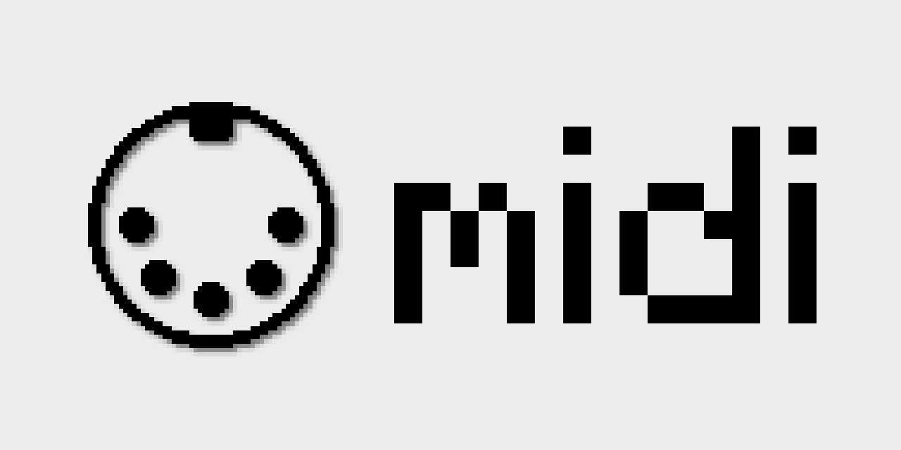

<!-- modrinth_exclude.start -->

[](LICENSE.md)
[](https://modrinth.com/plugin/midi)
<!-- modrinth_exclude.end -->

# 🎹 MIDI Plugin Message Mod

This Minecraft mod adds support for sending **MIDI actions** from the client to the server using **custom plugin messages**. It can be used to control in-game instruments, sound systems, lighting effects, or other MIDI-reactive features.

## 📦 Plugin Message: `midi:action`

The plugin message is based on a custom payload called `MidiAction`, sent via the `CustomPayload` system.

### `MidiAction` Payload Structure

```java
record MidiAction(
    String name,
    int command,
    int channel,
    int data1,
    int data2
)
````

| Field     | Type     | Description                                 |
| --------- | -------- | ------------------------------------------- |
| `name`    | `String` | Name of the MIDI device (e.g., "Launchpad") |
| `command` | `int`    | MIDI command (e.g., `144` = Note On)        |
| `channel` | `int`    | MIDI channel (0–15)                         |
| `data1`   | `int`    | First data value (e.g., note number)        |
| `data2`   | `int`    | Second data value (e.g., velocity)          |

## 🛠 Example Usage

### Sending from the Client

```java
ClientPlayNetworking.send(
    new MidiAction("Launchpad", 144, 0, 60, 127)
);
```

### Receiving on the Server

Register a global receiver in your server mod:

```java
ServerPlayNetworking.registerGlobalReceiver(
    MidiAction.ID,
    (payload, context) -> {
        System.out.println("Received MIDI action from device: " + payload.name());
    }
);
```

## ⚙️ Technical Details

* **Packet ID**: `midi:action`
* **Codec**: Custom implementation using `FriendlyByteBuf`
* **Minecraft Version**: 1.20.5+ (uses `CustomPacketPayload` API)

## ✅ Requirements

* Minecraft 1.20.5 or higher
* Fabric (or another compatible mod loader)
* A server mod that handles incoming `MidiAction` payloads

---

Got questions or suggestions? Feel free to open an [issue](https://github.com/uebliche/midi/issues) or reach out 
directly!
